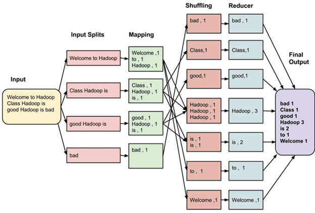

<h1 align="center">Questions for interview</h1>

## Description

Здесь будут вопросы, которые могу вам попасться на собесе и ответы них.

 
## Questions

1) Q: Что такое Spark  
A: Apache Spark или просто Spark — это фреймворк (ПО, объединяющее готовые компоненты большого программного проекта), который используют для параллельной обработки неструктурированных или слабоструктурированных данных (https://blog.skillfactory.ru/glossary/spark/).  
---
2) Q: Из первого вопроса вытекает что такое Map Reduce и в чём его суть?  
A: MapReduce – это модель распределённых вычислений от компании Google, используемая в технологиях Big Data для параллельных вычислений над очень большими (до нескольких петабайт) наборами данных в компьютерных кластерах, и фреймворк для вычисления распределенных задач на узлах (node) кластера. MapReduce можно по праву назвать главной технологией Big Data, т.к. она изначально ориентирована на параллельные вычисления в распределенных кластерах. Суть MapReduce состоит в разделении информационного массива на части, (параллельной обработки каждой части на отдельном узле)[map] и (финального объединения всех результатов)[reduce] (https://bigdataschool.ru/wiki/mapreduce).  
---
3) Q: Какие этапы есть в Map Reduce  
A: Map – предварительная обработка входных данных в виде большого список значений. При этом главный узел кластера (master node) получает этот список, делит его на части и передает рабочим узлам (worker node). Далее каждый рабочий узел применяет функцию Map к локальным данным и записывает результат в формате «ключ-значение» во временное хранилище.  
Shuffle – когда рабочие узлы перераспределяют данные на основе ключей, ранее созданных функцией Map, таким образом, чтобы все данные одного ключа лежали на одном рабочем узле.  
Reduce – параллельная обработка каждым рабочим узлом каждой группы данных по порядку следования ключей и «склейка» результатов на master node. Главный узел получает промежуточные ответы от рабочих узлов и передаёт их на свободные узлы для выполнения следующего шага. Получившийся после прохождения всех необходимых шагов результат – это и есть решение исходной задачи (https://bigdataschool.ru/wiki/mapreduce).
  
---
4) Q: Разница между Spark и Hadoop  
    <table> 
     <tbody> 
      <tr> 
       <td>&nbsp;</td> 
       <td> 
<strong>Hadoop</strong>
 </td> 
       <td> 
<strong>Spark</strong>
 </td> 
      </tr> 
      <tr> 
       <td> 
<strong>Архитектура</strong>
 </td> 
       <td> 
Hadoop хранит и обрабатывает данные во внешнем хранилище.
 </td> 
       <td> 
Spark хранит и обрабатывает данные во внутренней памяти.
 </td> 
      </tr> 
      <tr> 
       <td> 
<strong>Производительность</strong>
 </td> 
       <td> 
Hadoop обрабатывает данные в пакетном режиме.
 </td> 
       <td> 
Spark обрабатывает данные в реальном времени.
 </td> 
      </tr> 
      <tr> 
       <td> 
<strong>Стоимость</strong>
 </td> 
       <td> 
Сервис Hadoop доступен по цене.
 </td> 
       <td> 
Сервис Spark сравнительно дороже.&nbsp;
 </td> 
      </tr> 
      <tr> 
       <td> 
<strong>Масштабируемость</strong>>
 </td> 
       <td> 
Hadoop легко масштабируется за счет добавления большего количества узлов.
 </td> 
       <td> 
Spark сравнительно сложнее.
 </td> 
      </tr> 
      <tr> 
       <td> 
<strong>Машинное обучение</strong>
 </td> 
       <td> 
Hadoop интегрируется с внешними библиотеками для предоставления возможностей машинного обучения.&nbsp;
 </td> 
       <td> 
В Spark есть встроенные библиотеки машинного обучения.
 </td> 
      </tr> 
      <tr> 
       <td> 
<strong>Безопасность</strong>
 </td> 
       <td> 
Hadoop обладает мощными функциями безопасности, шифрованием хранилища и контролем доступа.
 </td> 
       <td> 
В Spark предусмотрена система безопасности базового уровня. ИТ-отдел полагается на то, что вы создадите безопасную операционную среду для развертывания Spark.&nbsp;
 </td> 
      </tr> 
     </tbody> 
    </table>  
   
   (https://aws.amazon.com/ru/compare/the-difference-between-hadoop-vs-spark/)
---
5) RDD, DF, Dataset - разнциа между ними(в рамках PySpark только RDD и DF)
6) Что такое DAG и как это связано со спарком
7) Разница между действиями и трансформациями
8) Разница между узкими и широкими трансформациями
9) Что такое job, stage, task
10) Виды джойнов(не лефт, райт и иннер, а именно стратегий джойна в спарке)
11) Когда какой джойн юзать
11) Почему нельзя писать бездумно collect и прочие такие штуки
12) Разница между repartion и coalesce(просто ответа что coalesce ток уменьшает а repartition может и увеличивать мало, мало даже если человек скажет что repartition это 
shuffle всегда). Логику того как под капотом это работает. Плюсы и минусы
13) как работает partitionBy
14) PartitionBy в комбинации с repartition или coalesce
15) Как уменьшить количество shuffle
16) Оптимизации которые юзает каталист
17) Как решить проблему Data Skew и вообще что это такое
18) UDF и почему PySpark UDF это плохо. Чем заменить PySpark UDF
19) Delta Lake и почему он
20) Менеджмент памяти на уровне JVM+overhead
21) Менеджмент памяти на полном уровне(если это PySpark то там не ток JVM и overhead)
22) Parquet - что это(рассказать всё что знаешь)
23) Нюансы при чтении JSON
24) Нюансы при чтении CSV
25) Broadcast variables